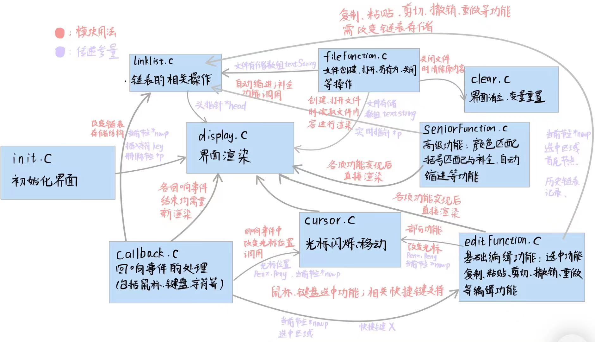

#  simpleIDE


### <轻量级C代码编辑器>

<!--s-->

## 目录
- 选题背景及意义
- 程序结构
- 核心数据结构
- 功能实现
   - 界面端
   - 文件端
   - 编辑端
- 难点
- 亮点
- 分工情况
- 团队体会和心得

<!--s-->

## 选题背景及意义

<font size="6">

- 代码编辑器是程序员必不可少的工具，对于编程效率、代码质量、程序稳定性等诸多方面都有着非常重要的影响。一款好的C代码编辑器不仅能够提高程序员的工作效率，而且还可以帮助我们避免很多常见的编程错误和问题，从而提高我们的编程经验和技能水平。 

- 轻量级的C代码编辑器更具有优势，它可以在低端设备上运行，方便用户使用。因此，研发一款高性能、轻量级的C代码编辑器具有较大的研究意义和应用价值。

</font>

<!--v-->

## 程序结构

1. 界面端
   - 初始化模块(init.c) 链表记录存储模块(linklist.c)
   - 界面渲染模块(display.c) 光标模块(cursor.c)
   - 回调模块(callback.c) 界面清除重置模块(clear.c)
2. 文件端
   - 文件处理模块(fileFunction.c)
3. 编辑端
   - 基础编辑功能模块(editFunction.c)
   - 高级功能模块(seniorFunction.c)

<!--v-->

## 模块交互图



<!--v-->

## 核心数据结构


与常规二维数组不同，采取双向链表为核心数据结构。

```c++
struct IDEText
{
	char text;//字符
	double x, y, len;//对应的坐标,与字符长度 
	int id, isChinese;//编号  是否是中文 
	struct IDEText * pre, * next;//前驱,后继 
}; 
```

<!--s-->

## 界面端核心功能实现

<!--v-->

<font size="5">

- **功能一**：文本输入，支持汉字功能
- 实现模块：界面渲染模块，链表存储记录模块，回调模块
- 算法：首先通过字符回调函数（myCharEvent）获取文本信息，文本的插入（Insert）通过链表来进行数据的存储，需要注意的是汉字占有两个字节(最高位为1)，需特殊处理。在界面渲染过程中（ReDrawText），遍历主链表，完善链表节点的坐标信息，根据字符长度以及换行符来改变画笔的位置，完成界面的文字渲染。

- **功能二**：当前位置光标闪烁
  - 实现模块：光标模块
  - 算法：利用计时器函数（mytimer），根据响应的奇偶性改变画笔的颜色，经由全局变量画笔位置来渲染出光标闪烁的动画。

- **功能三**：BackSpace后退擦除，Delete删除
  - 实现模块：回调模块，链表存储记录模块，光标模块
  - 算法：通过键盘回调函数（myKeyBoardEvent）来获取键盘的状态，判断是否要删除，以及删除的方式。BackSpace是从当前光标往前删，Delete是从当前光标的下一个往后删。通过链表节点的isChinese属性判断该节点是否是组成汉字的部分，汉字一次性删除两个节点，非汉字一次性删除一个节点。利用双向链表的性质进行删除（Delete）。

</font>

<!--v-->

<font size="5">

- **功能四**：上下左右移动光标
  - 实现模块：回调模块，光标模块
  - 算法：
   1. 左右移动光标：改变指向光标的链表节点nowp以及相应画笔位置(MoveCursor)，需要特判起点终点情况，以及换行的情况。
   2. 上下移动光标：获取nowp所指的字符在当前行的定位X(getLineNum)。向上移则与上一行进行比对，通过不断左移直至定位小于等于X，若已是第一行则不做处理；向下移则与下一行进行比对，通过不断右移直至定位等于X或者到了行末。已是最后一行则不做处理。

- **功能五**：鼠标定位光标
  - 实现模块：回调模块，光标模块
  - 算法：每一个链表节点都拥有一个坐标变量，对应于相关字符在编辑界面中的左下角坐标。其中组成汉字的两个节点的坐标变量一致。通过鼠标回调函数（myMouseEvent）获得鼠标状态，逐一比对主链表节点和鼠标坐标的相对关系来判断鼠标所指的是哪一个字符（FindCursor）。特殊情况的处理：换行符对应的长度设置为极大量，用于处理鼠标放在行末后面一定距离时光标应该定位在行末。得到对应链表节点的编号，通过不断地左（右）移动使指向光标的链表节点到相应位置来完成鼠标定位操作（ChangeCursor）。

</font>

<!--v-->

<font size="6">

- **功能六**：行号功能以及当前行高亮
  - 实现模块：界面渲染模块
  - 算法：首先将行号id转化为字符串，通过侧栏位置和字符串长度计算出首字母坐标，在行号变化时通过DrawTextString进行渲染（DrawSideLine）。对于当前行高亮，先计数得出当前位置所在的行数，由此计算出当前行下底的纵坐标，再对当前行构成的矩形进行高亮涂色（DrawNowLine）。

- **功能七**：鼠标右键快捷键功能
  - 实现模块：回调模块，界面渲染模块
  - 算法：通过鼠标回调函数（myMouseEvent）判定是否需要显示出快捷键菜单。如果需要，则通过simpleGUI的button功能渲染出快捷键菜单，比对用户点击的具体按钮来执行相应的快捷键（DrawContextMenu）。

</font>

<!--s-->

## 编辑端核心功能实现

<!--v-->

<font size="5">

- **功能一**：选中功能（支持鼠标、键盘快捷键）
  - 实现模块：基础编辑模块，界面渲染模块
  - 算法：
    1. 通过Choose系列函数进行选中节点记录，通过（JudgeChoose）与（FillRectangle）进行实时高亮。支持键盘shift+方向键选中、鼠标拖动选中。
    2. 通过（CancelChoose），（DeleteChoose）函数，令选中逻辑支持选中后输入字符（将选中内容替换为输入字符）、选中后输入方向键（取消选中）的功能

- **功能二**：复制、粘贴、剪切
  - 实现模块：基础编辑模块，链表存储记录模块
  - 算法：
    1. 将选中内容复制到新建的edithead链表中，完成复制操作（CopyFunction）；
    2. 将复制的内容以字符形式逐一插入主链表的当前节点后，完成粘贴操作(PasteFunction)；
    3. 结合复制函数和DeleteChoose（删除选中内容）函数，即可完成剪切操作(CutFunction)。

</font>

<!--v-->

<font size="5">

- **功能三**：撤回、重做
  - 实现模块：基础编辑模块，链表存储记录模块
  - 算法：将每一操作后主链表的全部文本记录于指针数组recordData中（RecordMove）；
将主链表的全部文本替代为撤回步数所对应的全部文本（RecoverMove）；通过对撤回步数进行计数，结合RecoverMove函数，即可完成撤回（ReturnMove）与重做（RedoMove）功能。

- **功能四**：特殊字符涂色
  - 实现模块：高级功能模块，界面渲染模块
  - 算法：通过Judge系列函数判定并涂色，判定逻辑分为以下三种情况：
     1. 括号、运算符、数字：直接将当前节点与对应库比较即可（JudgeBracket）
     2. 编译预处理语句、注释、字符串：自当前节点向前遍历，寻找对应的标志（字符串通过双引号出现次数的奇偶性判断）即可(JudgeString)
     3. 关键字：通过截取当前节点所在的“词”，将“词”与关键字库比较即可

</font>

<!--v-->

<font size="5">

- **功能五**：括号匹配
  - 实现模块：高级功能模块，界面渲染模块
  - 算法：在当前节点为括号时，分为左括号（向后寻找配对）与右括号（向左寻找配对）。为避免多次匹配的情况，设置hasMatching开关变量保证仅匹配一次。（BracketFrontPair）

- **功能六**：tab键逻辑
  - 实现模块：高级功能模块，界面渲染模块
  - 算法：通过计算当前行字符数进行运算，得出应当输入的空格数（DoTab）

- **功能七**：括号补全
  - 实现模块：高级功能模块，链表记录存储模块
  - 算法：当输入左括号时，会自动生成右括号，方便编辑代码（AddBracket）。

- **功能八**：自动缩进
  - 实现模块：高级功能模块，链表记录存储模块
  - 算法：通过与括号匹配相似的算法，对缩进量进行计数，从而完成自动缩进功能，方便编辑代码（RecalculateIndentation）（AddIndentation）

</font> 

<!--s-->

## 文件端核心功能实现

<!--v-->

### 重要变量及函数阐释
<font size="6">

1. OPENFILENAMEA结构体变量
   - 用来设置文件对话框的各种属性：文件名、路径、文件类型筛选等
2. GetSaveFileNameA和GetOpenFileNameA函数（Windows.h）
   - 这两个函数都需要一个指向OPENFILENAMEA结构体的指针作为参数来控制对话框的外观和功能。
   - GetOpenFileNameA函数会打开一个标准的文件打开对话框，允许用户浏览计算机上的文件系统，并选择一个文件来打开。
   - GetSaveFileNameA函数会打开一个标准的文件保存对话框，允许用户指定一个文件名并将其保存到计算机上的文件系统中。
   - 这两个函数都返回一个BOOL值来表示操作是否成功，并且如果操作成功时，传递给它们的OPENFILENAMEA结构体将保存用户所选路径和文件名等信息。

</font>

<!--v-->

<font size="5">

- 功能一：文件新建
  - 实现模块：文件处理模块
  - 算法：文件新建需要打开文件对话框，读取用户的选择的文件名称与路径，根据路径建立文件，并判断是否建立成功，若成功则更改文件打开标记。
- 功能二：文件打开
  - 实现模块：文件处理模块
  - 算法：需要打开文件对话框，用GetOpenFileNameA填充结构体，读取用户打开的文件名称与路径，并更改路径与名称的全局变量，根据路径打开文件，并将文件其中字符返回，更改文件打开标记。
- 功能三：文件保存
  - 实现模块：文件处理模块
  - 算法：根据此时全局变量中的路径打开文件，将链表中存在的字符全部写入文件中，并更改文件保存标记。
- 功能四：文件另存为
  - 实现模块：文件处理模块
  - 算法：需要打开文件对话框，读取用户输入的另存为文件名与文件路径，根据路径建立文件，并将当前文件内容全部写入该文件之中。
- 功能五：文件关闭和退出
  - 实现模块：文件处理模块
  - 算法：文件关闭时判断用户是否保存当前文件，之后更改打开文件标记。退出时判断是否打开文件单位保存，调用函数直接退出程序。

</font>

<!--s-->

## 难点

<font size="6">

1. 撤回操作数据存储困难
   - Solution：利用“降维”思想解决
2. 多类括号配对逻辑繁琐
   - Solution：拆分功能，设置总体开关。
3. 汉字功能逻辑陌生
   - Solution：研读simpleGUI，利用奇偶性质实现一般性功能。
4. 双向链表特殊情况繁多
   - Solution：虚设首尾节点，减少特判情况。
5. Windows交互BUG多
   - Solution：不断Search，不断调试。
6. 代码程序合并
   - Solution：小组成员深度交流。

</font>

<!--s-->

## 亮点

<!--v-->

<font size="5">

- 主干数据结构：
   - 以双向链表而非数组作为数据结构，既避免了无用的内存分配，通过动态内存分配来节省内存空间，又避免了当单个节点需要具备多个信息时创建多个数组，导致代码复杂性大大增加的情况。同时在插入和删除操作的过程，由于双向链表的性质使得上述过程可以在O(1)时间内完成，效率高。
- 文件端：
   - 可以打开文件对话框，用户可选择的路径可以可视化
   - 支持多种文件类型包括c、cpp、txt以及用户输入的别的文件后缀名
   - 用户可以在界面上方根据文件名判断是否保存，增加可视化功能
- 界面端：
   - 支持汉字功能，且不会因为输入法产生兼容性问题
   - 实现了鼠标定位功能和右键快捷键功能，支持键盘快捷键
   - 行号渲染功能，当前行粉色高亮
   - 改变固有的simpleGUI组件颜色。
   - 上述功能实现使得界面更好看，交互更贴近真实IDE
- 编辑端：
   - 撤回步数可以自行调整，目前设定为10步
   - 实现括号匹配、特殊字符变色
   - tab键逻辑算法的补全，逻辑算法及效果与Dev-C程序中tab键完全一致
   - 括号的自动补全，当输入左括号时会自动显示出右括号
   - 自动缩进功能，输入大括号时会自动进行缩进
   - 以上功能的实现令本程序在编程时流畅性大大增强。

</font>

<!--s-->

### 分工情况

<font size="5">

- 组员1 王昊元：
   - 实现程序代码编辑端的功能（数据选中涂色、复制粘贴剪切、撤回重做）、特殊字符/字符串涂色、tab键逻辑编写、括号配对逻辑、括号自动补充、编辑自动缩进

- 组员2 任飞扬：
   - 程序界面端的绘制（顶栏菜单、侧边栏、行号渲染）、文本输入（支持汉字功能）、光标闪烁功能、鼠标功能（定位、右键呼出快捷键）、键盘功能（上下左右移动光标、快捷键、删除键等）

- 组员3 吕梦月：
   - 实现程序文件端的功能，文件的新建、打开、保存、另存、关闭、退出

</font>

<!--s-->

### 团队体会和心得
- 本次项目中，3位组员对整个项目进行拆分为3个部分，即界面端、文件端、编辑端。组员分别完成自己部分功能的代码实现，并进行合并调试，通过共同的努力较好的实现了整个项目的所有功能。在本次项目中，我们深刻体会到了通过多人共同完成编程任务的流程与方式，这对我们未来的科研与学习有着很大的意义。同时，我们也在完成任务的过程中重塑代码风格，规范代码编辑，强化思维逻辑，建立合作精神，这是我们在本次项目中的重要收获。

<!--s-->

# THANKS！~

